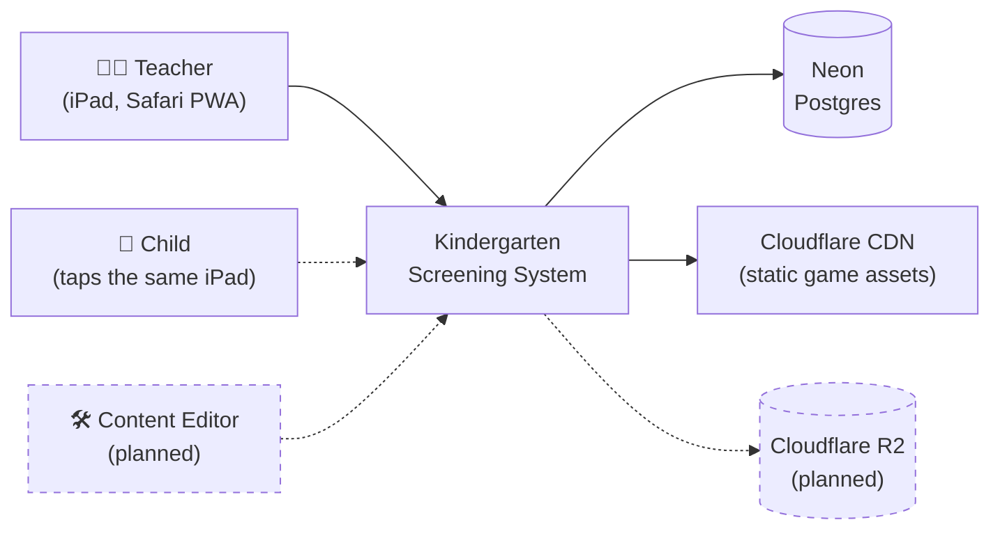
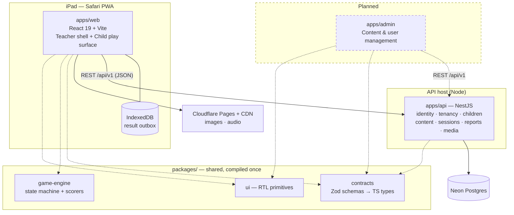
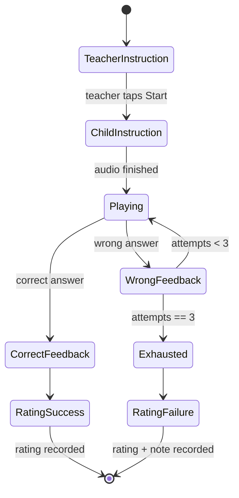
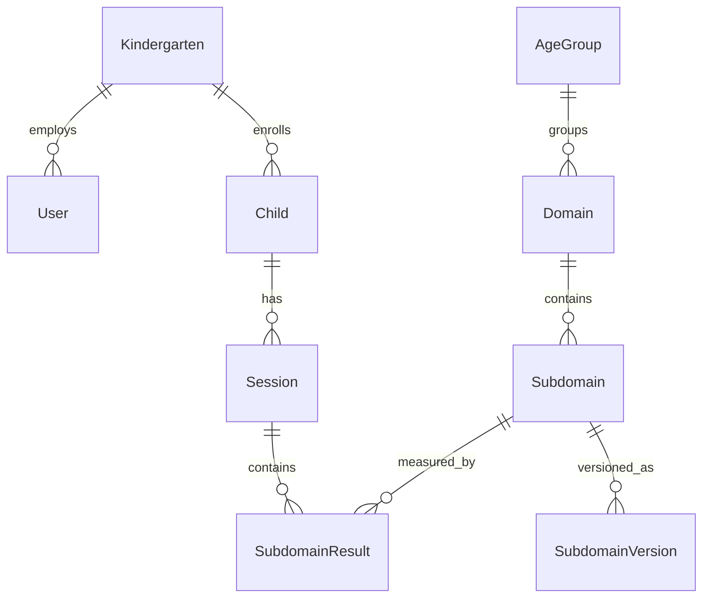

# High-Level Design — Kindergarten Screening & Diagnostic App

**Status:** Draft for execution
**Version:** 1.0
**Language of record:** English (requirements source is Hebrew — see §1.2)

---

## 1. Purpose, Scope & Audience

### 1.1 Purpose

This document translates the Hebrew technical specification into an **executable architecture**:
module boundaries, contracts, extension seams, package layout, and a build order. The
specification answers *what* the system does. This document answers *how it is built, in what
order, and where it is designed to grow.*

Four requirements drive every decision that follows:

| Requirement | Where it is answered |
|---|---|
| Modern technology stack | §5 Monorepo, §6 Contracts, §10 Backend, §11 Frontend |
| Clean code | §3 Principles, §10 layering, §11 structure, §15 Testing |
| Extensible | §7 Game-type plugin registry, §9 content versioning |
| Easy to add a management/admin layer later | §14 — the seams, made explicit |

### 1.2 Source of truth

The authoritative requirements document is
[`אפיון-טכני-אפליקציית-גני-ילדים-v2.md`](../../אפיון-טכני-אפליקציית-גני-ילדים-v2.md) (v3),
referenced throughout as **Spec §N**. Where this document and the spec disagree on *what* the
product does, the spec wins. Where they disagree on *how* it is built, this document wins.

### 1.3 Audience

Developers implementing the system, and the technical stakeholder reviewing the approach before
work begins.

### 1.4 In scope

- A content-driven diagnostic game engine, run by a teacher on an iPad with a child.
- Persistence of every rating and every individual answer.
- Reporting: per child, child vs. group, and cross-child pattern analysis.
- Hebrew RTL PWA, installed via "Add to Home Screen".

### 1.5 Explicitly out of scope (for now)

| Non-goal | Why |
|---|---|
| Full offline operation | Spec §2 — WiFi is assumed available; we build *resilience* to brief drops (§11.5), not offline-first. |
| Clinical diagnosis positioning | Spec §11.3 is unresolved. The system is designed and worded as a **screening/mapping tool for teachers**. |
| Parent-facing application | Not requested. The data model does not preclude it. |
| Microservices | §3.4 — a modular monolith is correct at this scale. |
| Admin application **implementation** | §14 — designed for, deliberately not built in the MVP. |

---

## 2. Baseline: Actual Repository State

Spec §2.2 describes scaffolding as complete. Verification against the working tree shows it is
**partially aspirational**. The roadmap in §17 treats foundation work as real, unfinished work.

| Spec §2.2 claims | Verified actual state |
|---|---|
| `kindergarten-app/{frontend,backend}` | `backend/` sits at the **repo root**, outside `kindergarten-app/` |
| NestJS + Prisma installed, `prisma init` run | `backend/package.json` has **no** `prisma` or `@prisma/client`; no `prisma/` directory exists |
| Neon project linked, `neon.ts` created | No `neon.ts`, no `.neon` file anywhere |
| `vite-plugin-pwa` registered in Vite config | Installed as a dependency, but **not registered** in `frontend/vite.config.ts` |
| Root `.gitignore` + initial commit | The `kindergarten-app` git repo has **zero commits**; `frontend/` is untracked |

What *does* exist and is worth keeping:

- **`kindergarten-app/frontend`** — React 19 + Vite 8 + TypeScript 6, `oxlint` configured.
- **`backend`** — NestJS 12, ESM (`"type": "module"`), Vitest for unit and e2e, `oxlint`, Prettier.

Both are modern and current. Milestone M0 (§17) consolidates and completes them; it does not
restart them.

---

## 3. Architecture Principles

These six principles are the reasoning behind every subsequent section. When a future decision is
ambiguous, resolve it against these.

### 3.1 Content is data, never code

Spec §1 states this as the central architectural principle, and it is correct: the dozens of
subdomains reduce to roughly eight interaction patterns. Adding a new subdomain must be a **row in
the database**, never a new screen in the codebase. Anything specific — images, audio, correct
answers, hotspot coordinates, difficulty — lives in `gameConfig` (JSON), validated by a schema.

The test of whether we have honored this: *adding a new subdomain requires zero code changes.*

### 3.2 Contract-first, defined once

Every request and response shape, and every `gameConfig` variant, is defined **once** as a Zod
schema in a shared package. TypeScript types are inferred from it; the API validates with it; the
OpenAPI document is generated from it; the client imports the same types. Hand-written DTOs
duplicated across a front end and a back end are the single most reliable source of drift in a
TypeScript project, and we simply do not have them.

### 3.3 Ports and adapters at seams that will move

Wherever we can name a likely future change, we put an interface there now — an injection token
with an adapter behind it. Three are known from the spec:

- **Storage** — static assets in the build today (Spec §2.1); Cloudflare R2 the moment a
  non-developer can upload an image (Spec §6). One adapter swap, no call-site changes.
- **Export** — PDF/Excel generation (Spec §7), likely to change libraries or move to a queue.
- **Clock** — so that time-dependent logic (age-group calculation from birth date) is testable.

We do not add ports speculatively. Three named seams, not thirty.

### 3.4 Modular monolith, extractable later

One deployable API with strict internal module boundaries. Modules communicate through their
public service interfaces, never by reaching into each other's repositories. If a module ever
needs to become a separate service, the boundary already exists. At the projected scale — a small
number of kindergartens — anything more than this is cost without benefit.

### 3.5 Tenant-aware and role-aware from day one

Spec §11.6 leaves multi-tenancy open: isolated kindergartens, or a network with cross-kindergarten
visibility? **We do not wait for the answer.** Carrying a `kindergartenId` and enforcing roles from
the first commit costs a few hours. Retrofitting tenant isolation into a live system holding data
about minors is a rewrite with a data-migration and a privacy incident attached. §9.2 and §13 make
both answers work.

### 3.6 Pure domain logic, isolated from frameworks

The session state machine (Spec §5) and the answer scorers contain the actual rules of the
product. They are written as **pure functions with no React, no NestJS, and no database** — in
`packages/game-engine`. They can then be tested exhaustively in milliseconds, and they can be
reused by the admin app's content preview without dragging a UI along.

---

## 4. Target System Architecture

### 4.1 Context



### 4.2 Containers



The important shape here: **`packages/contracts` is consumed by all three applications.** That is
what makes the admin app (§14) an addition rather than a rewrite.

---

## 5. Monorepo Layout

### 5.1 Target structure

```
kindergarten-app/
├─ apps/
│  ├─ web/            # ← current kindergarten-app/frontend
│  │                  #   React 19 + Vite + TS + vite-plugin-pwa (registered)
│  ├─ api/            # ← current ../backend  (Prisma added here)
│  │                  #   NestJS 12, ESM, Vitest
│  └─ admin/          # PLANNED (§14) — its own Vite app, reuses every package below
├─ packages/
│  ├─ contracts/      # Zod schemas + inferred types. The single source of truth. (§6)
│  ├─ game-engine/    # Pure session state machine, scorers, plugin registry types. (§7, §8)
│  ├─ ui/             # RTL-aware design-system primitives: TouchTarget, RatingBar, ...
│  └─ config/         # Shared tsconfig / oxlint / prettier presets
├─ docs/
│  └─ HIGH-LEVEL-DESIGN.md
├─ prisma/            # schema.prisma + migrations + seed (owned by apps/api, hoisted for tooling)
├─ pnpm-workspace.yaml
├─ turbo.json
└─ package.json
```

### 5.2 Tooling

| Concern | Choice | Why |
|---|---|---|
| Package manager | **pnpm workspaces** | Strict node_modules layout catches undeclared dependencies at install time — exactly the discipline a shared-package monorepo needs. Fast, disk-efficient. |
| Task orchestration | **Turborepo** | Declares the task graph (`build` depends on `^build`) and caches results. `turbo test` after a contracts change reruns only what depends on contracts. |
| Type composition | **TypeScript project references** | `apps/web` and `apps/api` reference `packages/contracts`; go-to-definition crosses package boundaries; incremental builds. |
| Lint / format | **oxlint + Prettier**, presets in `packages/config` | Already in use in both existing apps. Oxlint is fast enough to run on every save. |

### 5.3 The consolidation move (part of M0)

1. `git mv kindergarten-app/frontend → kindergarten-app/apps/web`.
2. Move root `backend/ → kindergarten-app/apps/api`.
3. Add `pnpm-workspace.yaml`, `turbo.json`, root `package.json`, root `.gitignore`.
4. **Install Prisma in `apps/api`** (`prisma`, `@prisma/client`) and run `prisma init` — Spec §2.2
   claims this was done; it was not.
5. **Register `VitePWA` in `apps/web/vite.config.ts`** — the plugin is installed but inert.
6. Provision Neon, link the project, pull `DATABASE_URL`.
7. **Make the first commit.** The repository currently has none.

A note on ESM: `apps/api` is `"type": "module"`. Keep it that way and configure Prisma and Nest
accordingly — mixed module systems inside one workspace are a recurring, avoidable source of
build friction.

---

## 6. Shared Contracts Layer

`packages/contracts` is the spine of the system.

```ts
// packages/contracts/src/child.ts
export const ChildSchema = z.object({
  id: z.uuid(),
  kindergartenId: z.uuid(),
  displayName: z.string().min(1).max(80),
  birthDate: z.iso.date(),
});
export type Child = z.infer<typeof ChildSchema>;

export const CreateChildSchema = ChildSchema.omit({ id: true });
export type CreateChild = z.infer<typeof CreateChildSchema>;
```

How each side consumes it:

- **API** — `nestjs-zod` turns each schema into a DTO class, giving both runtime validation and a
  generated OpenAPI document. The schema *is* the DTO.
- **Web** — imports `Child` directly. A field renamed in `contracts` becomes a compile error in
  both applications on the next build, not a runtime surprise in a kindergarten.
- **Admin (later)** — imports the same schemas and generates its forms from them (§14.1).

**Rule:** no type that crosses the network boundary is declared anywhere except `packages/contracts`.

---

## 7. The Game-Type Plugin Registry

This is the central extensibility mechanism, and the direct implementation of principle §3.1.

### 7.1 The plugin contract

Spec §4 identifies eight recurring interaction patterns. Each becomes one **plugin** implementing
a single interface:

```ts
// packages/game-engine/src/registry.ts
export interface GamePlugin<TConfig> {
  /** Stable identifier, persisted in the DB. Never renamed. */
  readonly id: GameTypeId;
  /** Validates gameConfig. Used by the API on write AND the client on render. */
  readonly configSchema: z.ZodType<TConfig>;
  /** Decides whether a given answer is correct. Pure. */
  readonly score: (config: TConfig, answer: unknown) => AnswerOutcome;
  /** Every asset URL this config needs — drives preloading (§11.4) and content validation (§15). */
  readonly assetsOf: (config: TConfig) => AssetRef[];
  /** Human-readable label + field hints, so the admin app can render an editor (§14.1). */
  readonly meta: GamePluginMeta;
}
```

The React component lives beside it in `apps/web`, keyed by the same `id`, so
`packages/game-engine` stays framework-free (§3.6).

### 7.2 `gameConfig` as a discriminated union

```ts
export const GameConfigSchema = z.discriminatedUnion('gameType', [
  BinaryImageChoiceConfig,   // Spec §4.1
  MultiImageChoiceConfig,    // Spec §4.2
  HotspotImageConfig,        // Spec §4.3
  DragMatchConfig,           // Spec §4.4
  SequentialTapConfig,       // Spec §4.5  — added M5
  ComparisonConfig,          // Spec §4.6  — added M5
  PuzzleConfig,              // Spec §4.7  — added M5
  PatternCopyConfig,         // Spec §4.8  — added M5
]);
```

Narrowing on `gameType` gives the exactly-correct config type in both the scorer and the component,
with no casts. The database column stays a single `Jsonb`, so **new game types need no migration.**

### 7.3 What "extensible" concretely means here

Adding game type #9:

1. Create `packages/game-engine/src/plugins/my-game/` — schema, scorer, `assetsOf`, meta.
2. Add its config to the discriminated union.
3. Create `apps/web/src/games/my-game/MyGame.tsx`.
4. Add one line to the registry map.

**Unchanged:** the session state machine, every API endpoint, the database schema, the reporting
layer, and the admin app's content editor — which reads `configSchema` and adapts automatically.

### 7.4 MVP scope

Per Spec §4's own recommendation, the MVP built **4.1, 4.2, 4.3, 4.4** first — they cover the large
majority of subdomains across all three age groups. The remaining four (**4.5–4.8**) landed at M5
exactly as predicted: four plugins, four components, four lines in the two registry maps, one enum
migration — no change to the session machine, the endpoints, or the data model (§17.1).

---

## 8. Session State Machine

Spec §5 defines the flow precisely. It is implemented once, as a **pure state machine** in
`packages/game-engine`, with no framework dependency.



Rules the spec calls out explicitly, encoded in the machine and covered by tests:

- `attemptsCount` is **per subdomain** and **resets** at the start of each one.
- The teacher **always** rates manually — the machine never auto-assigns a rating, even after a
  correct answer. The engine reports the outcome; the human decides.
- The free-text note field appears **only** on the three-failure branch (`RatingFailure`),
  never after success.
- The child's instruction audio plays **only after a user gesture** — the machine's transition into
  `ChildInstruction` is gesture-triggered, which is what makes Safari's autoplay policy (§11.4) a
  non-issue by construction rather than by patching.

Every individual answer is appended to a `rawAnswers` array as it happens, satisfying Spec §7's
requirement to retain each answer for analyses not yet defined.

**Implementation note:** a plain reducer (`(state, event) => state`) is sufficient and has zero
dependencies. Reach for XState only if the flow grows parallel or nested regions; it currently does
not have them.

---

## 9. Data Model

Prisma schema translating Spec §3, plus three things the spec does not address.

### 9.1 Core entities



| Entity | Notable fields |
|---|---|
| `Kindergarten` | `id`, `name`, `networkId?` (nullable — see §9.2) |
| `User` | `id`, `kindergartenId`, `email`, `passwordHash`, `role` (§13.1) |
| `Child` | `id`, `kindergartenId`, `displayName`, `birthDate` |
| `Session` | `id`, `childId`, `startedAt`, `ageGroupAtTime` (snapshot — a child crosses age bands) |
| `SubdomainResult` | `sessionId`, `subdomainId`, `subdomainVersionId`, `attemptsCount`, `rating`, `teacherNote?`, `rawAnswers Json` |
| `Subdomain` | `domainId`, `teacherInstruction`, `childInstruction`, `gameType`, `gameConfig Json` |

`rating` is an enum — `PRESENT`, `PARTIALLY_PRESENT`, `ABSENT` — mapping to Spec §5's
*קיים / קיים חלקית / לא קיים* (see the glossary in the appendix).

### 9.2 Multi-tenancy (resolves Spec §11.6 without waiting for the answer)

Every tenant-owned row carries `kindergartenId`, indexed. Access is scoped by a **Prisma client
extension** that injects the tenant filter into every query, so isolation is not dependent on each
developer remembering a `where` clause.

`Kindergarten.networkId` is nullable. Both answers to the open question work with no migration:

- **Isolated kindergartens** → `networkId` stays null; every query scopes to one kindergarten.
- **Network with cross-kindergarten reporting** → a `NetworkAdmin` role (§13.1) scopes to
  `networkId` instead.

### 9.3 Content versioning (a gap in the spec)

Editing a subdomain's `gameConfig` — changing an image, fixing a correct answer — would silently
change the meaning of results already collected under the old config. A March result and an
October result would look comparable in a report while measuring different things.

`SubdomainVersion` holds an immutable snapshot of `gameConfig`; `SubdomainResult` references the
version it was produced under. Reports can then legitimately compare like with like, and the admin
app can edit content freely without corrupting history. This is inexpensive now and effectively
impossible to add retroactively.

### 9.4 Auditing and retention

- `createdAt` / `updatedAt` / `deletedAt` on all business entities; soft delete throughout, because
  this is data about children and hard deletes need to be a deliberate, policy-driven act (§13.3).
- A dedicated `AuditLog` (actor, action, entity, timestamp) — needed the moment an admin layer lets
  someone change content or a rating.

---

## 10. Backend Architecture (`apps/api`)

### 10.1 Modules

Each is a NestJS module with an explicit public surface:

| Module | Responsibility |
|---|---|
| `identity` | Authentication, JWT issuance/refresh, password handling |
| `tenancy` | Kindergartens, networks, tenant-scope resolution |
| `children` | Child roster CRUD, age-group derivation from birth date |
| `content` | Age groups, domains, subdomains, versions; `gameConfig` validation |
| `sessions` | Session lifecycle, result submission, idempotent sync (§11.5) |
| `reports` | Read-model queries and exports (§12) |
| `media` | Asset manifests; `StoragePort` implementation (§10.3) |

### 10.2 Layering

```
Controller  → HTTP only. Zod-validated in, serialized out. No business logic.
   ↓
Service     → Business rules. Framework-agnostic where practical. The only layer worth
              reading to understand what the product does.
   ↓
Repository  → The only layer that imports PrismaClient.
```

Confining Prisma to repositories is what keeps services testable with plain fakes and keeps a
future database change from touching business logic. It is a small discipline with a large payoff,
and it is the concrete meaning of "clean code" in this codebase.

### 10.3 Ports

```ts
export const STORAGE_PORT = Symbol('StoragePort');
export interface StoragePort {
  getUrl(key: string): string;
  put(key: string, data: Buffer, contentType: string): Promise<string>;
}
```

- `StaticAssetStorage` — resolves CDN URLs for build-bundled assets (Spec §2.1). MVP default.
- `R2Storage` — Cloudflare R2 adapter. Registered instead, by configuration, on the day a
  non-developer needs to upload an image (Spec §6, §14.3).

Same pattern for `ExportPort` (PDF/Excel) and `ClockPort` (testable age calculation).

### 10.4 Cross-cutting

Global Zod validation pipe · global exception filter with a stable error shape · **pino** structured
logging with PII redaction (child names never reach logs, §13.3) · `/health` and `/ready` endpoints ·
`@nestjs/config` with a Zod-validated environment schema, so a missing variable fails at boot rather
than at 9 a.m. in a kindergarten.

---

## 11. Frontend Architecture (`apps/web`)

### 11.1 Stack

React 19 + Vite 8 + TypeScript 6 (already in place) · **TanStack Query** for all server state ·
**Zustand** for in-session UI state · **React Router** · **react-i18next** · Tailwind CSS with
logical properties · **Recharts** for reports (Spec §2).

The TanStack Query / Zustand split matters: server state (children, content, past results) has
caching, staleness, and retry semantics that a hand-rolled store gets wrong; session state
(current attempt, current answer) is ephemeral and local. Using one tool for both is the usual
source of a confused data layer.

### 11.2 Structure

```
apps/web/src/
├─ app/         # routing, providers, error boundaries
├─ features/    # children/ · sessions/ · reports/ · auth/   (feature-scoped: api, hooks, components)
├─ games/       # one folder per game plugin — mirrors the registry (§7)
├─ shared/      # AudioUnlockProvider, AssetPreloader, outbox, i18n
└─ styles/
```

Two distinct route shells:

- **Teacher shell** — dense, informational: roster, session setup, ratings, reports.
- **Child play surface** — full-bleed, chrome-free, minimum 80px touch targets (Spec §10), no
  navigation a child can wander into mid-exercise.

They are separate layouts because they serve two different users on one device with genuinely
opposite design requirements.

### 11.3 Hebrew / RTL

`dir="rtl"` at the root; **CSS logical properties everywhere** (`margin-inline-start`, never
`margin-left`) so nothing is hard-coded to one direction; every string externalized through
`react-i18next` from the first component. The externalization is not speculative i18n — it is what
keeps copy editable without a developer, and it is why the admin UI and any future second language
cost little.

### 11.4 iPad / Safari specifics (Spec §2)

- **`AudioUnlockProvider`** — Safari blocks audio without a prior user gesture. A single
  provider unlocks the `AudioContext` on the first tap of the session and exposes a `play()` that is
  thereafter always permitted. Combined with §8's gesture-triggered transition, no instruction audio
  can be silently swallowed.
- **`AssetPreloader`** — before a subdomain begins, `plugin.assetsOf(config)` (§7.1) yields every
  image and audio file it needs; all are fetched and decoded up front. No mid-exercise stall while a
  child waits.
- **PWA** — register `VitePWA` (currently inert, §2), precache the app shell and the asset
  manifest, and provide the icons and splash screen for "Add to Home Screen".

### 11.5 Resilience to brief disconnection

Results are written first to an **IndexedDB outbox** (Dexie), then synced to the API in the
background with retry. A momentary WiFi drop mid-session cannot lose a rating that a teacher has
already given — and re-asking a teacher to re-rate a child she has moved on from is not a recoverable
error in practice.

Each queued result carries a client-generated UUID; the API's submission endpoint is **idempotent**
on that key, so a retried sync cannot create a duplicate.

---

## 12. Reporting & Analytics

Spec §7 defines three views. Each is a dedicated read-model query service in the `reports` module,
kept separate from the write-path services — reporting queries have different shapes and different
performance characteristics, and mixing them into CRUD services is how both become hard to change.

| View | Definition |
|---|---|
| **Single child over time** | Progression per domain and subdomain, textual and charted. |
| **Child vs. group** | A child's ratings against the distribution of their kindergarten cohort. |
| **Cross-child patterns** | All children in a kindergarten segmented by strength/difficulty, so the teacher can form working groups — Spec §7's most valuable and most-specified report. |

Charts render client-side with Recharts. PDF and Excel export runs server-side behind `ExportPort`
(§10.3), so it can move to a background queue later without touching the endpoint.

All three read `SubdomainResult` joined to `SubdomainVersion` (§9.3), so a comparison never
silently spans a content change.

---

## 13. Security & Privacy

This system holds developmental assessment data about identifiable minors. That fact sets the bar.

### 13.1 Roles

| Role | Scope |
|---|---|
| `TEACHER` | Their own kindergarten's children, sessions, and reports |
| `KINDERGARTEN_ADMIN` | Their kindergarten's staff and roster |
| `NETWORK_ADMIN` | All kindergartens under one `networkId` (§9.2) — only if the network model is confirmed |
| `CONTENT_EDITOR` | Content across tenants; **no access to child data at all** |

Enforced by a NestJS guard reading route metadata. `CONTENT_EDITOR` deliberately cannot read child
data — content authoring has no business touching it, and separating them now costs one enum value.

### 13.2 Authentication

JWT access token (short-lived) + refresh token (rotated, revocable). Passwords hashed with argon2id.
Given the shared-iPad reality of a kindergarten, sessions should be short and re-authentication
quick — a fast PIN-style re-entry for an already-authenticated device is worth designing when
teacher workflow is validated with a real user (M3).

### 13.3 Privacy measures

- Tenant isolation is **tested explicitly** (§15), not assumed from the Prisma extension.
- No child PII in logs, error reports, or analytics — enforced by pino redaction (§10.4).
- Soft delete everywhere plus a documented retention and hard-deletion policy, once Spec §11.2
  is answered.
- TLS everywhere; Neon connections over TLS.

### 13.4 Two open questions that block production, not development

Spec §11.2 (who legally owns the data; retention and deletion policy) and §11.3 (is this positioned
as a screening tool or a clinical diagnosis) must be answered **before real children's data is
entered**. They do not block building. Flagging them now so they are resolved on a calm schedule
rather than during a launch.

---

## 14. The Future Admin Layer — the Seams

This is the requirement to be able to "easily build management for the whole application later."
The admin app is not in the MVP. What follows is what will already exist when it starts, so that it
is an *addition* and not a refactor.

### 14.1 Content management → schema-generated forms

The registry (§7.1) already carries, for every game type, a `configSchema` describing every field
and its constraints, plus `meta` with labels and hints. The admin app therefore **generates** its
config editors from those schemas instead of hand-building a form per game type. A new game type
becomes editable in the admin UI the moment it is registered — with no admin-side work at all.

This is the single highest-leverage consequence of the contract-first principle (§3.2).

### 14.2 The hotspot editor (Spec §6)

Spec §6 asks for an internal tool where an editor drags rectangles over an image and the tool emits
the coordinate JSON. It is a self-contained screen whose output is exactly
`HotspotImageConfig.targets` — a schema that already exists and already validates. Roughly a day of
work, sitting entirely on top of established contracts.

### 14.3 Media upload

Register `R2Storage` instead of `StaticAssetStorage` (§10.3). Configuration, not code. This is the
transition Spec §2.1 and §6 both anticipate, and it is a one-line registration precisely because we
put a port there in advance.

### 14.4 User and kindergarten management

RBAC roles (§13.1), tenant scoping (§9.2), and the audit log (§9.4) are all in place from M0. The
admin screens are CRUD over entities that already enforce their own access rules.

### 14.5 Where it lives

`apps/admin` — its own Vite application, importing `packages/contracts`, `packages/ui`, and
`packages/game-engine` (to *preview* a game exactly as a child will see it, using the same scorer).
Separate from `apps/web` because a desktop content-authoring tool and a child-facing iPad surface
share almost no UI requirements — but they share every contract, which is the part that matters.

### 14.6 Summary

| Admin capability | Prerequisite | Status after MVP |
|---|---|---|
| Content CRUD + generated editors | `configSchema` + `meta` per plugin | ✅ built (M6) |
| Hotspot coordinate editor | `HotspotImageConfig` schema | ✅ built (M6) |
| Image/audio upload | `StoragePort` R2 adapter | ✅ built (M6) — `STORAGE_DRIVER=r2` |
| User & role management | RBAC guard + roles | ✅ built (M6) |
| Kindergarten/network management | `kindergartenId` + `networkId` | ✅ built (M6) |
| Change accountability | `AuditLog` | ✅ exists |

Nothing on that list requires changing the game engine, the session flow, or the data model.

---

## 15. Testing Strategy

| Layer | Tool | What it covers |
|---|---|---|
| Domain units | Vitest | The state machine (§8) and every scorer — pure functions, exhaustive cases, milliseconds. The three-attempt rule and the note-only-on-failure rule are tested here, once, for all game types. |
| API integration | Vitest + Supertest | Each module against a real Postgres (a Neon branch or Testcontainers). **Includes explicit tenant-isolation tests** — kindergarten A must not be able to read kindergarten B's children through any endpoint. |
| Critical path E2E | Playwright | One flow, kept green: log in → start session → answer wrong ×3 → rate with a note → result persisted and visible in a report. |
| **Content validation** | Vitest | Every seeded `gameConfig` is parsed by its plugin's `configSchema`, and every asset returned by `assetsOf` is asserted to exist on disk. |

That last one deserves emphasis. Once content is data (§3.1), **content can be broken without the
code changing** — a typo'd filename, a missing correct answer. This test is the guardrail that makes
content-as-data safe, and it is what will catch a broken exercise before a teacher does, in front of
a child.

---

## 16. Deployment & Environments

| Component | Target | Notes |
|---|---|---|
| `apps/web` | **Cloudflare Pages** | Free, unmetered bandwidth, global CDN. Static game assets ship in the build (Spec §2.1) and are served from the edge. |
| `apps/api` | **See below — a gap in the spec** | |
| Database | **Neon (Frankfurt)** | Scale-to-zero suits intermittent kindergarten-hours usage; branch per environment. |
| Object storage | Cloudflare R2 | Not provisioned until §14.3. |

### 16.1 API hosting — unresolved in the specification

Spec §2.1 and §2.2 cover frontend hosting and the database thoroughly but **never state where the
NestJS API runs.** It needs a persistent Node host. Options, with the trade-off that matters:

| Option | Consideration |
|---|---|
| **Fly.io** | Small always-on instance; can scale to zero, at the cost of cold-start latency on the first request of the morning. |
| **Render** | Free tier sleeps after inactivity — a ~30s wake is a poor first impression for a teacher starting her day. |
| **Railway** | Usage-based; predictable and simple at this scale. |
| **Cloudflare Workers** | Keeps everything on one platform, but NestJS on Workers is a non-trivial adaptation. Not recommended for the MVP. |

**Recommendation:** Fly.io with a minimum of one warm instance during kindergarten hours. Decide at
M0, because it shapes the CI deployment step.

### 16.2 CI/CD

GitHub Actions: `lint → typecheck → test → build`, orchestrated through Turborepo so a PR touching
only `apps/web` does not rebuild the API. Merges to `main` deploy web to Cloudflare Pages and API to
the chosen host. Prisma migrations run as an explicit, reviewed deployment step — never automatically
on boot.

---

## 17. Roadmap

Each milestone has one exit criterion, phrased as something you can demonstrate.

| # | Milestone | Exit criterion |
|---|---|---|
| **M0** | **Foundation** — monorepo consolidation (§5.3), Prisma installed, Neon linked, PWA plugin registered, CI green, both apps deployed with a placeholder, **first commit made** | A trivial change pushed to `main` reaches the deployed web app and API automatically. |
| **M1** | **Data model & API** — Prisma schema (§9), migrations, seed, `contracts` package, CRUD for children/content/sessions, auth + RBAC + tenant scoping | Postman/OpenAPI walkthrough: create a kindergarten, a teacher, a child, a session, a result. Tenant-isolation tests pass. |
| **M2** | **Game engine** — registry (§7), plugins 4.1–4.4, their React components, `AudioUnlockProvider`, `AssetPreloader`, all on mock content and placeholder assets | All four game types playable on an iPad from a JSON fixture. No real content required. |
| **M3** | **Vertical slice** — state machine (§8) wired end to end, teacher rating screens, outbox sync, for **one age group × one domain with real content** | A teacher runs a real child through a real subdomain; the rating and every raw answer are in Neon. **Test with an actual teacher before M5.** |
| **M4** | **Reports** — the three views (§12) plus PDF/Excel export | A teacher opens a child's progression and the cross-child grouping report from real M3 data. |
| **M5** | **Content expansion** — remaining age groups and domains per Spec §9; remaining game types 4.5–4.8 as registry additions | Content-validation tests pass over the full seeded content set. |
| **M6** | **Admin application** (§14) — content CRUD, hotspot editor, media upload via R2, user management | A non-developer adds a new subdomain, with a new image, without a deployment. |
| **M7** | **UX overhaul & product expansion** — design system in `packages/ui`, a home dashboard, richer child management (search/filter/photo), a practice ("free play") mode, and visual polish across reports and the game surface. Additive only — see [`docs/M7-UX-EXPANSION.md`](./M7-UX-EXPANSION.md). | The app has a home screen with kindergarten-wide stats, and a teacher can run an undocumented practice game without touching assessment data. |

M3 is the milestone that matters most. It is the first point at which the design meets a real
teacher and a real child, and it is deliberately placed **before** the expensive content work in M5
— so that anything the workflow gets wrong is discovered while it is still cheap to change.

### 17.1 Delivery status

| # | State | Notes |
|---|---|---|
| M0 | ✅ done | Monorepo consolidated, Prisma + Neon linked, `VitePWA` registered, first commit made. |
| M1 | ✅ done | `packages/contracts`, Prisma schema, CRUD + auth + RBAC + tenant scoping in `apps/api`. |
| **M2** | ✅ **done** | See below. |
| **M3** | ✅ **done** | See below. |
| **M4** | ✅ **done** | See below. |
| **M5** | ✅ **done** | See below. |
| **M6** | ✅ **done** | Admin app: schema-generated content CRUD, hotspot editor, R2 media upload, staff & kindergarten management. See below. |
| **M7** | 🟡 **code done** | Design system, home dashboard, richer children mgmt, practice mode, a login-screen restyle, and a sidebar/topbar app shell built (M7.1–M7.5 + M7.5.1 of docs/M7-UX-EXPANSION.md). Real illustrations/audio and a live-teacher pass on the new UI (M7.6–M7.7) remain, as designed — non-development work. See below. |

**M2 — Game engine.** Delivered:

- `packages/game-engine` — `GamePluginRegistry`, the five MVP plugins (§7.4 4.1–4.4 plus
  `MANUAL_OBSERVATION` for Spec §18.1 q5), and the pure `sessionReducer` (§8). A new `ADVANCE`
  event ticks the input-less feedback phases (`CorrectFeedback`, `Exhausted`) forward; the reducer
  still never auto-assigns a rating.
- `apps/web/src/games/` — one React component per plugin, keyed by the same `gameType` id, plus
  `registry.ts` (`gameComponents` map + `engineRegistry`). Adding game type #N is a plugin, a
  component, and one line in the map (§7.3).
- `apps/web/src/shared/audio/AudioUnlockProvider.tsx` — unlocks `AudioContext` inside the teacher's
  Start gesture, then `play()` is always permitted (§11.4). Placeholder prompts are synthesised
  tones (`tone:` scheme) — Spec §8's human recordings are an M2-parallel pipeline, not a blocker.
- `apps/web/src/shared/assets/` — `placeholder.ts` (inline-SVG images, tone audio) and
  `AssetPreloader` / `useAssetPreload`, which fetch and decode every `plugin.assetsOf(config)` entry
  before `Playing` (§11.4).
- `apps/web/src/features/sessions/GamePlayer.tsx` — wires the reducer to the components: prompt
  playback, three-attempt loop, feedback, and the manual rating screen (note field on the failure
  branch only).
- `apps/web/src/mock/subdomains.ts` + the `App.tsx` harness — the JSON fixture the M2 exit criterion
  calls for; all five subdomains run end to end with no backend and no real content. `pnpm turbo
  build` and `pnpm --filter @kga/game-engine test` are green.

Not in M2 (deferred as designed): the outbox sync and real teacher shell (M3), TanStack Query
(added in M4 when reports need caching), and any real assets.

**M3 — Vertical slice.** One teacher, one child, one domain of real content, end to end into Neon.
Delivered:

- `apps/api/prisma/seed.ts` — one real domain, *מודעות פונולוגית* (phonological awareness) for
  `AGE_4_5`, with five subdomains that between them exercise all five MVP plugin types. Pedagogical
  copy (teacher and child instructions, correct answers) is real; media is still placeholder
  (`tone:` audio, inline-SVG images) per §18.2 — the human-recording pipeline (§18.2) runs
  alongside, not before.
- `apps/web/src/shared/auth/AuthProvider.tsx` + `shared/api/client.ts` — a `fetch` wrapper with
  access-token attach and one-shot refresh-on-401 (§13.2), and `features/auth/LoginScreen.tsx`.
- `apps/web/src/shared/outbox/` — the §11.5 result outbox. `db.ts` is a thin hand-rolled
  IndexedDB store (Dexie deferred — see deviations below); `OutboxProvider.tsx` owns the
  background flush, firing on enqueue, on `online`, and on a 15 s catch-all interval. Every result
  carries a client-generated `clientId`; `POST /sessions/sync` is idempotent on it, so an
  over-eager flush is harmless. A brief WiFi drop mid-session cannot lose a rating already given.
- `apps/web/src/features/children/RosterScreen.tsx` — the teacher's roster, scoped to their
  kindergarten by the API's tenant filter (§9.2).
- `apps/web/src/features/sessions/SessionRunner.tsx` — session orchestration over one domain:
  create the session (snapshotting `ageGroupAtTime`), load every subdomain's play config, run each
  through M2's `GamePlayer`, queue each `SubdomainRunResult` to the outbox against its
  `subdomainVersionId` (§9.3), then `completeSession` (best-effort — the outbox still delivers).
  A closing summary shows each rating and the sync state.
- `apps/web/src/App.tsx` + `main.tsx` — rewired to the provider stack (`AuthProvider`,
  `AudioUnlockProvider`, `OutboxProvider`) with three views switched by local state.

**Deliberate deviations from §11.1**, to keep the slice's dependency surface small — all revisited
at M4: no TanStack Query, no React Router (one linear flow, local-state view switching), no Dexie
(raw IndexedDB), no `react-i18next` (Hebrew strings inline for now). The backend `sessions` and
`content` endpoints M3 consumes were already built in M0/M1.

`pnpm turbo build` and `pnpm --filter @kga/game-engine test` are green. **The M3 exit criterion —
a real teacher runs a real child through a real subdomain — still needs to be exercised with an
actual teacher before M5 (§18.2).**

**M4 — Reports.** The three §12 views over real M3 data, plus export. Delivered:

- `apps/api/src/reports/` — `ReportsService` now resolves human-readable labels (child name, domain
  and subdomain names) so the client renders without N+1 lookups. Endpoints:
  `GET /reports/children/:id/progression`, `/vs-group`, `GET /reports/subdomains/:id/patterns`, and
  `GET /reports/subdomains` (the subdomains this tenant has results for — drives the patterns
  picker). Every query is tenant-scoped through the session join (§9.2); a cross-tenant child id
  404s. All three read `SubdomainResult` and its resolved version so a comparison never silently
  spans a content change (§9.3).
- Export runs behind `ExportPort` (§10.3) — still the MVP `JsonExportAdapter` — but the controller
  now streams it as a real `attachment` download (`Content-Disposition`), one endpoint per view.
  Swapping in a PDF/Excel adapter, or a queue, is unchanged at the call site.
- `apps/api/test/reports.e2e-spec.ts` — the §15 explicit tenant-isolation test for the report
  endpoints: kindergarten A's patterns and progression never surface kindergarten B's children,
  even for a subdomain both kindergartens have results in.
- `packages/contracts/src/reports.ts` — schemas extended with the resolved names and a
  `ReportSubdomain` list type; `ChildProgression` / `ChildVsGroup` / `CrossChildPattern` gained
  `childName` / `subdomainName` / child `{id, displayName}` entries.
- `apps/web/src/features/reports/` — `ReportsScreen` (tab switch + child picker), `ProgressionReport`
  (Recharts step line, rating on a 0–2 ordinal axis with Hebrew tick labels), `VsGroupReport`
  (stacked cohort-distribution bars with the child's own rating called out), `PatternsReport`
  (subdomain picker → three strength columns). `shared.tsx` holds the rating scale, palette,
  `ExportButtons`, and a small `useAsync` fetch helper. `shared/api/client.ts` gained `apiBlob` for
  authenticated file downloads (same one-shot refresh as `api`).
- `App.tsx` / `RosterScreen.tsx` — a "דוחות" button on the roster header opens the reports view.
  `recharts` added to `apps/web` (the one §11.1 dependency M4 actually needs).

**Deviations still standing** (from the M3 list, revisited here as promised): TanStack Query and
React Router remain deferred — the reports screens are read-only and low-traffic, and the linear
local-state flow still holds; both land with the admin app (M6) when mutations, cache sharing, and
deep links pay for themselves. `react-i18next` likewise still deferred.

`pnpm turbo build`, `lint`, `typecheck`, and the `game-engine` / `contracts` unit tests are green.
The reports e2e (like the M1 tenant-isolation e2e) needs a Postgres on `DATABASE_URL` to run.

**M5 — Content expansion.** Game types 4.5–4.8, plus the full seeded content set across all three
age groups. Delivered:

- **Game types 4.5–4.8** as pure registry additions (§7.3), no architectural work:
  - `packages/contracts/src/game-config.ts` — `SequentialTapConfig` (§4.5), `ComparisonConfig`
    (§4.6), `PuzzleConfig` (§4.7 — carries the `rows × cols === pieceCount` cross-field rule on the
    refined schema the plugin validates with; the discriminated union takes the plain object),
    `PatternCopyConfig` (§4.8, odd-one-out). Added to `GameTypeIdSchema` and the union.
  - `packages/game-engine/src/plugins.ts` — `sequentialTapPlugin`, `comparisonPlugin`,
    `puzzlePlugin`, `patternCopyPlugin`, each with a pure `score` and `assetsOf`. `MVP_PLUGINS` is
    now `GAME_PLUGINS` (nine). Scorer tests added.
  - `apps/web/src/games/{sequential-tap,comparison,puzzle,pattern-copy}/` — one child-surface
    component each (tap-to-sequence pads; two items + "שווה"; tap-to-place puzzle with sliced-image
    pieces; odd-one-out grid), wired into `gameComponents` — four lines.
  - `apps/api/prisma/schema.prisma` — `GameType` enum gains the four values;
    `migrations/20260908120000_m5_game_types` is the `ALTER TYPE … ADD VALUE` migration. The `Json`
    `gameConfig` column is unchanged — new game types need no schema change (§7.2).
- **Content** — `apps/api/prisma/content.ts` is the full catalogue (Spec §9): `AGE_3_4`, `AGE_4_5`
  (the M3 phonological-awareness domain kept verbatim, ids and all, so existing results stay linked),
  and `AGE_5_6` — 11 domains, ~40 subdomains, exercising all nine game types. Real Hebrew
  pedagogical copy (teacher and child instructions, correct answers); media still placeholder
  (`tone:` audio, inline-SVG images) per §18.2. `seed.ts` now iterates this catalogue.
- **Content-validation guardrail (§15)** — `apps/api/prisma/content.spec.ts`: every seeded config
  parses under its plugin's `configSchema`, every `assetsOf` url resolves, every referenced id
  exists within its own config, and the intended answer actually scores correct. `vitest.config.ts`
  picks up `prisma/**/*.spec.ts`. 200 api unit tests green.
- `apps/web/src/features/sessions/SessionRunner.tsx` — the M3 "first domain only" shortcut is
  replaced by a **domain picker**: the teacher chooses which of the age group's domains to run.

**Deviations still standing:** TanStack Query, React Router, `react-i18next`, Dexie — all still
deferred to M6 as in M3/M4; nothing in M5 changed the case for them. The M5 web components use
tap-to-place rather than HTML drag (consistent with the M2 `DragMatch` decision — more reliable on a
shared iPad).

`pnpm turbo build lint typecheck test` is green (14 tasks). The e2e suites still need a Postgres on
`DATABASE_URL`; `prisma migrate deploy` / `prisma db seed` apply the M5 migration and content.

---

**M6 — Admin application.** `apps/admin` — its own Vite + React 19
app (§14.5), sharing `packages/contracts` and `packages/game-engine`, no
`packages/ui` (a desktop authoring tool and a child iPad surface share no UI).
Delivered:

- **Scaffold** — `apps/admin/` with the standard tsconfig project-reference split,
  `@vitejs/plugin-react`, a `/api` dev proxy on port 5174, and `oxlint` config
  mirroring `apps/web`. No PWA plugin. `pnpm-workspace.yaml` picks it up via
  `apps/*` — no workspace change needed.
- **Auth** — `shared/api/client.ts` (the same thin fetch wrapper + one-shot
  refresh as `apps/web`, separate `kga.admin.*` token keys) and
  `shared/auth/AuthProvider.tsx`, which **rejects any non-`CONTENT_EDITOR`
  login** (§13.1 — content authoring has no child-data access, and the converse:
  a teacher account cannot enter the admin app).
- **Schema-generated content editor (§14.1)** — the highest-leverage piece.
  `features/content/SchemaForm.tsx` converts a game plugin's `configSchema` to
  JSON Schema (`z.toJSONSchema`, Zod v4) and renders a form recursively from it —
  objects, arrays (add/remove), tuples, enums, literals, numbers, strings,
  booleans — with `plugin.meta.hints` shown inline. `SubdomainEditor.tsx` wires
  the generated form to the subdomain metadata fields, live-validates the whole
  config against the real `plugin.configSchema` on every keystroke (issue list +
  `assetsOf` preview), and offers a raw-JSON toggle as an escape hatch. A new
  game type becomes fully editable here the moment its plugin is registered —
  **zero admin-side code**.
- `features/content/ContentBrowser.tsx` — age-group tabs → domains → subdomains,
  with create / rename / soft-delete for domains and create / edit / soft-delete
  for subdomains.
- **API surface** — `content` module gained `PATCH /content/domains/:id`,
  `DELETE /content/domains/:id` (refuses while subdomains remain),
  `DELETE /content/subdomains/:id`, and `GET /content/subdomains/:id/versions`,
  all `CONTENT_EDITOR`-gated and audit-logged. `CreateDomainSchema` /
  `UpdateDomainSchema` moved into `packages/contracts`. Subdomain create/edit and
  the `SubdomainVersion` snapshot-on-config-change (§9.3) were already built in
  M1.

- **Hotspot coordinate editor (§14.2)** — `features/content/HotspotEditor.tsx`.
  Drag a rectangle over the image to add a touch region; click one to select and
  fine-tune `x/y/width/height` (numeric, normalised 0..1); mark which regions are
  correct. It emits exactly `HotspotImageConfig` — the same contract the plugin
  `score` hit-tests and `HotspotImageConfigSchema` validates — so it plugs into
  `SubdomainEditor` in place of the generic `SchemaForm` for `HOTSPOT_IMAGE`,
  with the live issue list, `assetsOf` preview and raw-JSON escape hatch
  unchanged. Pure frontend, no new contract.
- **Media upload (§14.3)** — `StoragePort` now resolves through a factory
  (`storageFactory` in `media.module.ts`): `STORAGE_DRIVER=static` keeps
  `StaticAssetStorage`; `STORAGE_DRIVER=r2` returns `R2Storage`
  (`media/r2.storage.ts`) — a hand-rolled SigV4 `PUT` against R2's S3 API, zero
  new dependencies, consistent with the codebase's minimalism. `POST
  /media/upload` (`CONTENT_EDITOR`, audit-logged, 5 MB, image/audio allowlist)
  stores the file and returns its URL; the admin's `HotspotEditor` (and any
  future config field) uploads through it and drops the URL straight into the
  config. The call site never sees which driver is active (§3.3).
- **Staff & kindergarten management (§14.4)** — `identity/users.controller.ts` +
  `users.service.ts`: `GET/POST /users`, `PATCH /users/:id`, `DELETE /users/:id`
  (soft), `KINDERGARTEN_ADMIN` / `NETWORK_ADMIN`-gated and scoped — a
  kindergarten admin manages their own gan's staff, a network admin the whole
  network; neither can grant a role above their own or provision a
  `CONTENT_EDITOR` (cross-tenant, out of band). Kindergarten CRUD was already in
  `tenancy` from M1. `apps/admin` now admits those two roles at the front door
  (`AuthProvider`) alongside `CONTENT_EDITOR`, and `App.tsx` shows a **content**
  or **staff** surface (or a tab switch when an account somehow holds both) —
  `features/staff/StaffBrowser.tsx` is CRUD over users and kindergartens with
  role and gan reassignment and password reset. `UpdateUserSchema` added to
  `packages/contracts`.

Still deferred: React Router (the admin surface is two flat screens),
`react-i18next` (Hebrew inline). The R2 adapter builds and typechecks but is
unverified against a live bucket — the same placeholder-until-real posture as
the media pipeline (§18.2).

`pnpm turbo run build typecheck lint test` is green (19 tasks); 200 API unit
tests pass. The e2e suites still need a Postgres on `DATABASE_URL`. The admin app runs against the existing seeded `editor@demo.dev`
account (content) and any `KINDERGARTEN_ADMIN` / `NETWORK_ADMIN` account (staff).

**M7 — UX expansion (design + product additions per docs/M7-UX-EXPANSION.md).**
M7.1–M7.5 are implemented and green; M7.6 (real illustrations/narration) and
M7.7 (a live-teacher pass on the new screens) are non-development work, as the
plan always scoped them. Delivered:

- **M7.1 — design tokens + `packages/ui` (§2).** `apps/web/src/styles/app.css`
  gained the M7 token block (`--accent-2/3`, gradients, `--success/warning/danger`,
  radii, shadows, motion durations/eases) additively — nothing existing was
  renamed. `packages/ui` gained ten framework-free components (`PageHeader`,
  `StatCard`, `Avatar`, `ProgressRing`, `EmptyState`, `SearchInput`,
  `FilterChips`, `Toast`, `ConfettiBurst`, `MascotBubble`); each is markup +
  behaviour only, styled by the class names the consuming app defines (§2.4's
  own design), so `apps/admin` gets the same look by reusing the same classes.
- **M7.2 — Home.** `GET /reports/kindergarten/summary` (`ReportsService`) is a
  concentration of existing queries — child count, this-week session count,
  percent of the roster diagnosed this month, and the month's most-challenging
  subdomain by non-`PRESENT` rating count — plus the five most recent sessions.
  `apps/web/src/features/home/HomeScreen.tsx` is now the landing screen after
  login (`App.tsx`), with the `StatCard` row, four gradient quick-action cards,
  and a recent-activity list.
- **M7.3 — Children.** `Child.photoUrl` (nullable, Prisma migration
  `20260909090000_m7_practice_and_photo`) plus `GET /children?search=&ageGroup=`
  on top of the existing tenant-scoped list. `RosterScreen` gained `SearchInput`,
  age-band `FilterChips`, an `Avatar` per row, `ChildDialog` (add/edit with a
  live-computed age group and a photo upload through the *same* `POST
  /media/upload` M6 built — now also `TEACHER`/`KINDERGARTEN_ADMIN`-gated, not
  only `CONTENT_EDITOR`), and a soft-delete confirm dialog with a `Toast` on save.
- **M7.4 — Practice / free play.** `SessionMode` (`ASSESSMENT` default |
  `PRACTICE`) on `Session`, same migration. Every §12 report query and the
  patterns subdomain-picker now filter to `mode: ASSESSMENT`, so practice never
  skews a real screening statistic. `apps/web/src/features/practice/PracticeScreen.tsx`
  reuses M2's `GamePlayer` directly — no new game surface — with a domain/
  subdomain picker spanning *all* age groups (unlike the assessment flow, which
  stays scoped to the child's own age group) and a "save result" toggle
  (default off, requires a child to be selected); saved runs create a
  `PRACTICE` session and queue through the same outbox (§11.5) as an assessment.
- **M7.5 — visual polish.** `GamePlayer`'s correct/wrong feedback phases now
  carry the `.feedback` classes plus a `ConfettiBurst` and a CSS `shake`; the
  patterns report's three columns (`ReportsScreen` → `PatternsReport`) gained
  icons and a soft gradient wash from the `--success/warning/danger` tokens —
  no logic changed in either.
- **Not built (by design, §5 of the M7 doc):** M7.6 real illustrations and
  human narration, and M7.7 a validation pass with an actual teacher on the new
  UI — both are content/validation work, not code, exactly as scoped.
- **M7.5.1 — login screen and app shell (§3.7, §3.8 of the M7 doc, a
  follow-up request).** `AppShell` and `SyncBadge` — new markup-only
  `packages/ui` components, styled in `apps/web/src/styles/app.css` ("app
  shell" / "login") like every other §2.4 component. `AppShell` wraps
  **only** the three browsing/management screens (`HomeScreen`,
  `RosterScreen`, `ReportsScreen`) in a persistent sidebar (brand mark, nav,
  user + logout) and topbar (page title, the outbox `SyncBadge`, a "New
  assessment" shortcut) — those three screens each dropped their own
  duplicate `PageHeader`/back-button chrome. `SessionRunner` (an active
  assessment) and `PracticeScreen` stay entirely outside the shell, exactly
  as they were kept outside the view-switch before M7 — the moment a child
  is at the iPad, no sidebar nav belongs on screen (§11.2). `LoginScreen`
  restyled onto a new `.login-screen` (a `--gradient-soft` backdrop behind a
  floating `.login-panel`) with no behavioural change. Still no router
  (§11.1) — three shell views in local state remain enough at this size.
  `pnpm turbo run build typecheck lint` is green (16/16 tasks) across all
  three apps and both shared packages.

`pnpm turbo run build typecheck lint test` is green (19 tasks); the 200 API
unit tests plus the new content-independent reports-summary logic pass. The
migration has not been applied against a live database from this session — run
`prisma migrate deploy` (§16.2, an explicit reviewed step) before deploying.

## 18. Open Questions & Risks

### 18.1 The spec's open questions (§11), triaged

| # | Question | Design position | Truly blocks? |
|---|---|---|---|
| 1 | Deployment scale (how many kindergartens/iPads at launch) | Free tiers cover a small rollout; §16 upgrade paths documented | No |
| 2 | Data ownership, retention, deletion policy | Soft delete + audit log in place; policy needs a decision | **Yes — before real data (§13.4)** |
| 3 | Screening tool vs. clinical diagnosis | All wording is screening-oriented; affects legal positioning | **Yes — before launch** |
| 4 | Incomplete content (vocabulary, letters for ages 5–6) | Content-as-data means these arrive as rows, not code | No — blocks M5 only |
| 5 | Which "physical" subdomains stay manual | Handled by a `MANUAL_OBSERVATION` game type — a rating screen with no game | No |
| 6 | Multi-tenancy: isolated or networked | §9.2 supports both with no migration | **No — resolved by design** |
| 7 | Will non-developers upload images | §10.3 `StoragePort` makes this a config swap | **No — resolved by design** |

Three of seven are neutralized by the architecture. Two are genuine, and both are policy decisions
rather than technical ones — worth starting now precisely because they do not block engineering.

### 18.2 Risks the spec does not name

| Risk | Impact | Mitigation |
|---|---|---|
| **Human voice recordings are a long-lead dependency** | Spec §8 requires a human narrator for phonetic accuracy — TTS is explicitly unacceptable. Scripting, recording, and editing dozens of prompts can easily outrun the code. | Start the recording pipeline at **M2**, in parallel with engine work. Use placeholder audio until it lands. This is the most likely schedule risk in the project. |
| **Asset licensing** | Spec §8 warns against unlicensed images. A licensing problem discovered late is a content rebuild. | Record the license for every asset in the seed data; make it a required field. |
| **Neon free-tier compute** | 100 CU-hours/month across several kindergartens is finite. | Monitor from M1; the Launch plan is a paid upgrade with no migration. |
| **iPad Safari PWA quirks** | Add-to-Home-Screen behavior, storage eviction, and audio policy all differ from desktop Safari. | Test on a real iPad from **M2**, not at the end. A simulator will not surface these. |
| **Teacher workflow assumptions** | The rating-after-every-exercise flow is specified but unvalidated with a real user under real conditions. | M3 exists precisely to test this before content investment. |

---

## Appendix A — Glossary

Consistent naming between the Hebrew requirements and the English codebase.

| Hebrew | English identifier | Notes |
|---|---|---|
| גן | `Kindergarten` | The tenant boundary |
| גננת | `Teacher` (`User` with `role: TEACHER`) | Operates the app; always the one who rates |
| ילד | `Child` | The subject; never a system user |
| תחום | `Domain` | e.g. phonological awareness, visual perception |
| תת-תחום | `Subdomain` | The unit of measurement; maps to one game config |
| סשן אבחון | `Session` | One sitting with one child |
| קיים | `PRESENT` | Rating enum |
| קיים חלקית | `PARTIALLY_PRESENT` | Rating enum |
| לא קיים | `ABSENT` | Rating enum |
| הערת גננת | `teacherNote` | Free text; **only** on the three-failure branch |
| ניסיונות | `attemptsCount` | Max 3, resets per subdomain |
| נקודות מגע | `hotspots` / `targets` | Spec §4.3, §6 |

## Appendix B — Spec Traceability

| Spec § | Covered in |
|---|---|
| §1 Summary, content-driven principle | §3.1, §7 |
| §2 Technology stack, iPad/Safari notes | §5, §10.1, §11.1, §11.4 |
| §2.1 Cost strategy, storage | §10.3, §16 |
| §2.2 Existing scaffold | §2 (corrected), §5.3 |
| §3 Data model | §9 |
| §4 Game-type taxonomy | §7 |
| §5 Session flow | §8 |
| §6 Hotspot mechanism & admin tool | §7.2, §14.2 |
| §7 Analytics & reports | §12 |
| §8 Media assets | §11.4, §18.2 |
| §9 Full content breakdown | §17 (M3, M5) |
| §10 Non-functional requirements | §11.2, §11.3, §16 |
| §11 Open questions | §18.1 |
| §12 Proposed work plan | §17 |
